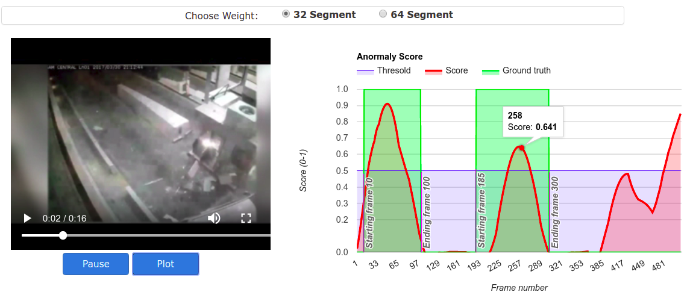

# Road Accident Detection From Surveillance Videos

## Overview

Django web application for demonstration purpose.



* Upload video from local or directly from Youtube
* Plot abnomaly score of video frame by frame.


## Setup Ubuntu 18.04

1. Create Conda environment and install dependencies.
   ```
   conda create -n env
   source activate env
   pip install -r requirements.txt
   ```
   
2. Install Broker [rabbitmq][https://www.rabbitmq.com/download.html] and start its service.
   ```
   $ sudo systemctl start rabbitmq-server
   ```
   
3. Create user name, password, set credentials, create vhost accordingly. See CELERY_BROKER_URL in [setting file](locallibrary/setting.py)
   ```
   # create user
   $ sudo rabbitmqctl add_user catalog catalog
   # create virtual host
   $ sudo rabbitmqctl add_vhost catalog
   # set permission of virtual host to user catalog
   $ sudo rabbitmqctl set_permissions -p catalog catalog ".*" ".*" ".*"
   ```  

4. Get sports1m model weight:
    -  Download file https://github.com/adamcasson/c3d/releases/download/v0.1/sports1M_weights_tf.h5, rename and save in 'c3d/trained_models/c3d_sports1m.h5'
    
5. Open new terminal, activate conda env and run Celery worker server. More information in [celery](http://docs.celeryproject.org/en/latest/getting-started/first-steps-with-celery.html#tut-celery)
```
    celery -A locallibrary worker -l info
```

6. Start Django web app:
   ```
   python manage.py makemigrations
   python manage.py migrate
   python manage.py collectstatic
   python manage.py runserver
   ```
   
7. Open brower to `http://127.0.0.1:8000`.
